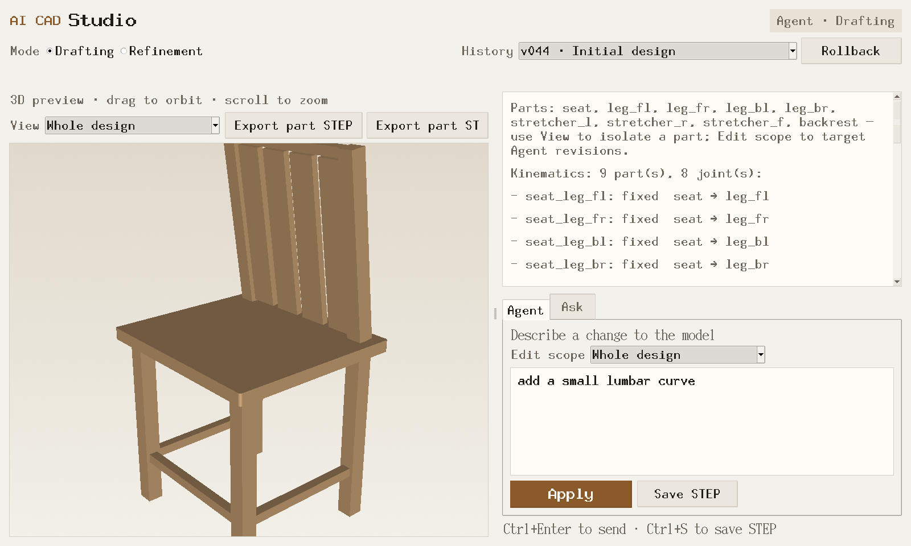
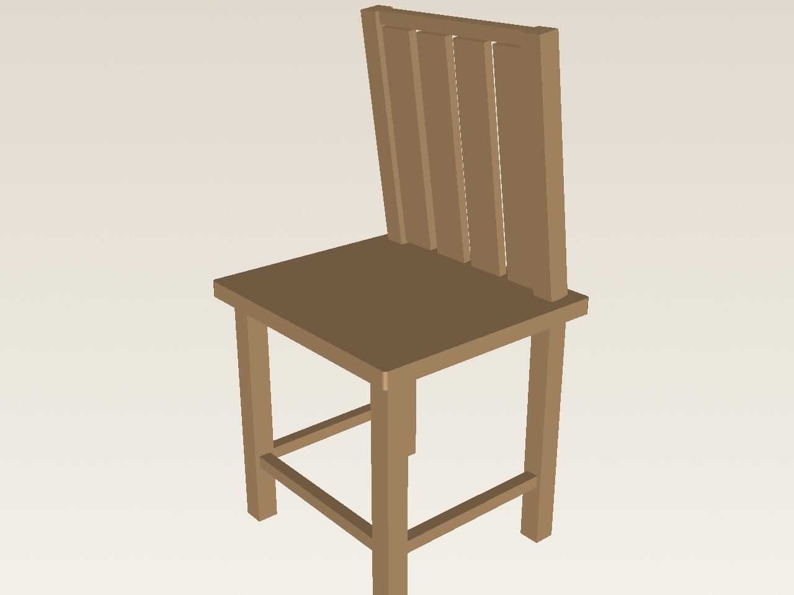
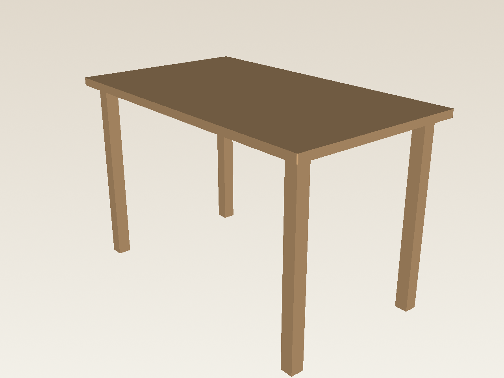
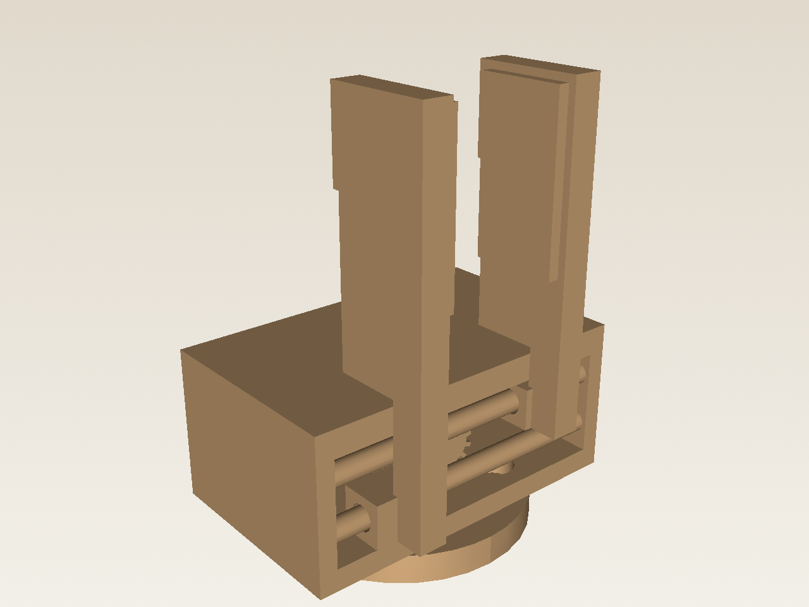
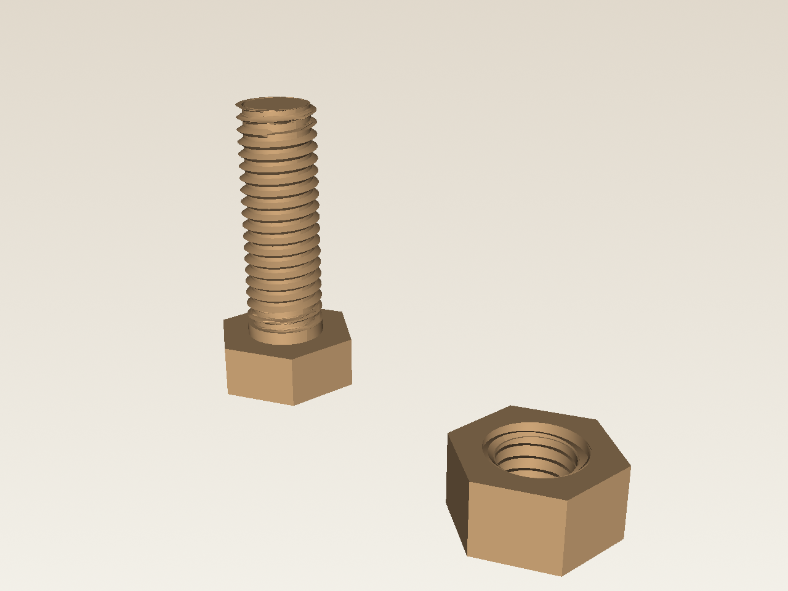
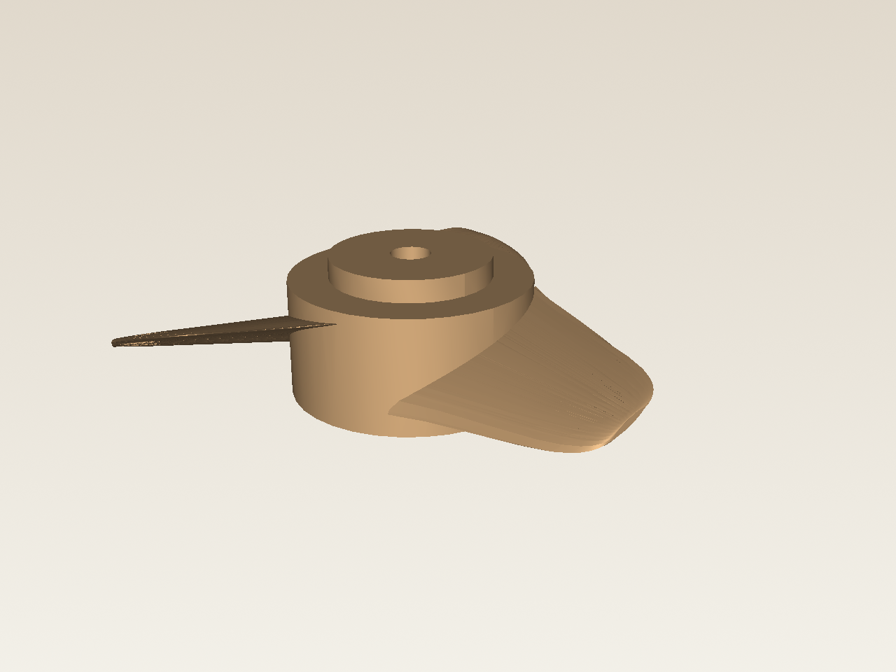

# AgentCAD

**Language → CadQuery → STEP**, driven by a Cursor agent with an interactive 3D studio.

Describe a product in plain English. AgentCAD writes parametric CadQuery, builds the solid, shows it in VTK, and lets you revise by chat — with parts, version history, drafting/refinement modes, and crash recovery.

---

## Features

| Area | What you get |
|------|----------------|
| **Agent design** | Cursor SDK writes `generated/current_design.py` (Grok / Claude / OpenAI / Composer) |
| **Studio** | Orbit/zoom 3D preview + Agent / Ask chat |
| **Parts** | Named parts — view, export, or edit one at a time |
| **STEP import** | Load existing STEP as agent constraints (bbox, holes, topology) |
| **Drafting vs refinement** | Fast “builds & renders” loop, or full feature/physics review |
| **Version history** | Snapshot each change; rollback design + chat (**Ctrl+Z**) |
| **Self-repair** | CadQuery errors fed back to the agent until build succeeds |
| **Crash recovery** | Context worksheet + new agent resume after API / context failures |

---

## Requirements

- Python **3.10+** (3.11–3.13 recommended)
- Linux / macOS / Windows with a working display (Tk + VTK)
- A [Cursor API key](https://cursor.com/dashboard/integrations) for live designs  
  (optional: offline **mock** backend for UI demos)

---

## Setup

```bash
git clone <your-repo-url> AgentCAD
cd AgentCAD

python -m venv .venv
source .venv/bin/activate          # Windows: .venv\Scripts\activate

pip install -r requirements.txt
```

Configure environment:

```bash
cp .env.example .env
# Edit .env and set:
#   CURSOR_API_KEY=cursor_...
```

Or export for the session:

```bash
export CURSOR_API_KEY=cursor_...
```

---

## Quick start

```bash
python start_design.py
```

1. Enter a design brief (e.g. *“a wooden dining chair with a slight recline”*).
2. Wait while the agent generates CadQuery and builds the mesh.
3. The **Studio** opens — orbit the model, revise in **Agent**, ask questions in **Ask**.
4. **Ctrl+S** saves STEP + matching `.py` under `models/`.

### Studio



Orbit the solid on the left. Revise in **Agent**, inspect dimensions in **Ask**, switch **Drafting / Refinement**, and roll back from **History**.

### Example designs

Renders from designs produced in this repo (parametric CadQuery → tessellated preview).

<table>
  <tr>
    <td align="center" width="50%">
      
      <br /><em>Dining chair</em> — named parts, fixed welds, no collisions
    </td>
    <td align="center" width="50%">
      
      <br /><em>Table</em> — top + four legs, face-contact welds
    </td>
  </tr>
  <tr>
    <td align="center">
      
      <br /><em>Parallel-jaw gripper</em> — flange, housing, sliding fingers
    </td>
    <td align="center">
      
      <br /><em>Bolt and nut</em> — two parts, not welded (floating is allowed)
    </td>
  </tr>
  <tr>
    <td align="center" colspan="2">
      
      <br /><em>Trolling-motor propeller</em> — lofted blades on a hub
    </td>
  </tr>
</table>

Regenerate these images with `python docs/render_readme_images.py`.

### Useful flags

```bash
python start_design.py --fast      # Cursor model fast mode
python start_design.py --no-fast   # force fast off even if DESIGN_FAST=1
python start_design.py --model grok-4.6
python start_design.py --model claude
python start_design.py --model openai
python start_design.py --list-models

DESIGN_LLM=mock python start_design.py   # offline demo, no API key
```

---

## Studio guide

### Modes (header)

- **Drafting** (default) — stop once the design compiles, renders, parts do not collide, and welded pairs touch. Fast iteration.
- **Refinement** — after each build, check key features + physics; refine until pass or budget ends.

After every successful build with two or more named parts, compile-time feasibility runs:

- **Collision** — overlapping volume between named parts is a failure (face contact is OK)
- **Weld contact** — each `fixed` joint must be in contact. Unrelated parts, or parts that are not *directly* welded, may float

Either failure is treated like a compile error and the agent is asked to rebuild.

### Parts

Designs should expose named parts via `parts()` (assembly in `build()`).

- **View** — isolate a part in the 3D preview  
- **Export part STEP** / **Export all STEP** — separate STEP files  
- **Export part STL** — single-part triangle mesh  
- **ZIP all STLs** — folder of part meshes + a `.zip` under `models/`  
- **Export URDF** — package folder with `*.urdf` + per-part STL meshes  
- **Import STEP** — add an existing STEP as agent context (ghost overlay in the preview)

Multi-part designs must define `joints()`: a tree of `{type, parent, child}` relations for the URDF. Use `revolute` / `prismatic` when that motion is part of the product function. Use `fixed` only for parts that are actually fastened. Unrelated parts are left unwelded (separate roots).

### Imported STEP references

Load a STEP **before the first prompt** (Load STEP… on the start dialog) or later with **Import STEP** in the studio.

The agent does not only display the file. It:

- Copies it to `generated/references/<name>.step` (kept out of the Cursor agent via `.cursorignore`)
- Extracts bbox, volume, solid count, face types, and cylinder radii (holes/shafts)
- Writes `generated/references/<name>.md` and injects those facts into generate / revise / Ask / review
- Can use the exact B-rep in CadQuery via `import_reference("name")` (injected at runtime)

The live design stays parametric CadQuery. The imported STEP is a constraint (mate, envelope, matching holes). A translucent overlay in the 3D view shows the reference next to the current design. The agent is told **not** to open the binary STEP — only the measured facts and `import_reference()`.

- **Edit scope** (Agent tab) — apply a revision to the whole design or one part  

### Agent vs Ask

- **Agent** — language edits that rewrite CadQuery and rebuild  
- **Ask** — read-only Q&A about dimensions / structure (source + measured facts; no RGB by default)

### Version history

Every successful design (open + each Agent apply) is snapshotted under `generated/versions/`.

- Pick a version in **History** → **Rollback**  
- Or **Ctrl+Z** for the previous version  

Rollback restores CAD, features, and chat transcript, and clears the Cursor agent conversation.

### Shortcuts

| Shortcut | Action |
|----------|--------|
| **Ctrl+Enter** | Send Agent / Ask message |
| **Ctrl+S** | Save full assembly STEP + script |
| **Ctrl+Z** | Roll back to previous version |

---

## Configuration

Copy from `.env.example`. Common variables:

| Variable | Default | Meaning |
|----------|---------|---------|
| `CURSOR_API_KEY` | — | Cursor Integrations API key |
| `DESIGN_MODEL` | `grok-4.5` | Cursor SDK model id or alias (`grok-4.6`, `claude`, `openai`, …). CLI `--model` overrides |
| `DESIGN_LLM` | `auto` | `auto` \| `cursor` \| `mock` |
| `DESIGN_MODE` | `draft` | `draft` \| `refine` |
| `DESIGN_FAST` | off | `1` / `true` → model `fast=true` |
| `DESIGN_DEBUG_RETRIES` | `5` | Build → debug / collision-fix cycles |
| `DESIGN_COLLISION` | on | `0` / `false` to skip compile-time collision + weld-contact checks |
| `DESIGN_REVIEW_ROUNDS` | `3` | Review → refine rounds (refine mode) |
| `DESIGN_AGENT_RECOVERIES` | `3` | Worksheet relaunches per failed send |
| `DESIGN_UI_SCALE` | auto | Override HiDPI UI scale (e.g. `2.0`) |

`--model` / `DESIGN_MODEL` accept an alias or a raw Cursor SDK id. `--model` wins over the env var.

| Flag / alias | Resolves to |
|--------------|-------------|
| `grok-4.5` (default) | `grok-4.5` |
| `grok-4.6` | `grok-4.6` |
| `claude` | `claude-sonnet-5` |
| `claude-opus` | `claude-opus-5` |
| `openai` | `gpt-5.4` |
| `composer` | `composer-2.5` |

Run `python start_design.py --list-models` for the full alias list. Any other string is passed through as the Cursor model id.

---

## Project layout

```text
AgentCAD/
├── start_design.py          # Entry: prompt → agent → studio
├── requirements.txt
├── .env.example
├── cad_pipeline/
│   ├── agent.py             # Cursor/mock agent, review, recovery
│   ├── runtime.py           # Execute CadQuery, parts, STEP export
│   ├── joints.py            # joints() parse / URDF tree validation
│   ├── urdf.py              # URDF + mesh package export
│   ├── studio.py            # Tk + VTK interactive UI
│   ├── versioning.py        # Design / chat snapshots
│   ├── context_worksheet.py # Crash-recovery memory
│   └── ...
├── docs/images/             # README studio + design gallery
├── generated/               # Working design, renders, versions (gitignored)
└── models/                  # Saved STEP + .py exports
```

Generated CadQuery is expected to look like:

```python
def parts():
    return {
        "seat": ...,
        "leg_fl": ...,
        "backrest": ...,
    }

def joints():
    return [
        {"type": "fixed", "parent": "seat", "child": "leg_fl"},
        {"type": "fixed", "parent": "seat", "child": "backrest"},
        # revolute / prismatic only when that motion is part of the product
    ]

def build():
    solid = None
    for p in parts().values():
        solid = p if solid is None else solid.union(p)
    return solid
```

---

## Tips

- Prefer **Drafting** while exploring form; switch to **Refinement** before locking a design.
- Use **Edit scope** for local changes (e.g. only `backrest`) so other parts stay stable.
- If the Cursor agent stalls or hits context limits, check `generated/context_worksheet.md` — recovery relaunches from that file automatically.
- On 4K/5K displays, set `DESIGN_UI_SCALE=2.0` (or similar) if chrome feels too small/large.

---

## License

Add your preferred license here.
